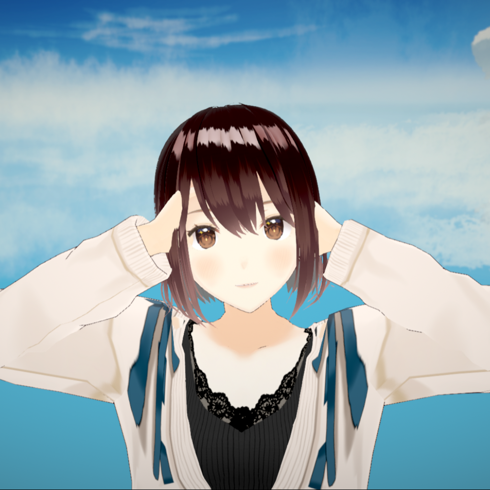
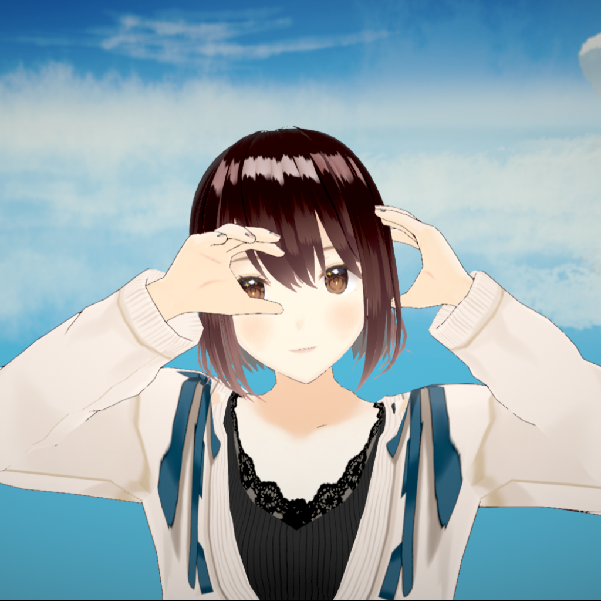

# Experimental features

Use the **Experimental** tab only after you tune the base retargeting. Test one setting at a time with the motion that you want to improve.

## Transfer mode

Open **Transfer mode** and select **Mode**:

- **Offset** copies bone rotations through the T-pose offset.
- **Muscle** uses muscle conversion. It is similar to Unity Mecanim, but not entirely. 

Corrections run in both modes. **Muscle limits** and **Adjust muscles** appear in the **Retarget** tab only in Muscle mode.

## Hand contact

The **Hand alignment** foldout contains **Hand contact (experimental)**. When enabled, it pulls hands toward the set **Hand contact distance** as they come together. Use it for claps or heart-hand gestures, then check the result with the intended motion.

### Before and after

Use **Slider** to drag the divider. The left side shows the result without hand contact. The right side shows **Hand contact**.

  <button type="button" :aria-pressed="comparisonMode === 'slider'" @click="comparisonMode = 'slider'">Slider</button>
  <button type="button" :aria-pressed="comparisonMode === 'side-by-side'" @click="comparisonMode = 'side-by-side'">Side by side</button>
  <button type="button" :aria-pressed="comparisonMode === 'overlay'" @click="comparisonMode = 'overlay'">Overlay</button>

  
  
</img-comparison-slider>

  <figure>
    
    <figcaption>Before</figcaption>
  </figure>
  <figure>
    
    <figcaption>Hand contact</figcaption>
  </figure>

  
  

## Hand anti-penetration

::: warning Experimental feature
Hand anti-penetration is a best-effort correction. It can reduce some hand-to-body intersections, but it can change the hand pose. It cannot solve every avatar shape, input quality level, or fast motion.
:::

The shipped default is **Off**. Enable it only after you tune the base retargeting.

### Before and after

Use **Slider** to drag the divider. The left side shows the result with anti-penetration **Off**. The right side shows anti-penetration enabled.

  <button type="button" :aria-pressed="comparisonMode === 'slider'" @click="comparisonMode = 'slider'">Slider</button>
  <button type="button" :aria-pressed="comparisonMode === 'side-by-side'" @click="comparisonMode = 'side-by-side'">Side by side</button>
  <button type="button" :aria-pressed="comparisonMode === 'overlay'" @click="comparisonMode = 'overlay'">Overlay</button>

  
  
</img-comparison-slider>

  <figure>
    
    <figcaption>Before</figcaption>
  </figure>
  <figure>
    
    <figcaption>Anti-penetration</figcaption>
  </figure>

  
  

### Choose a mode

| Mode | Description |
| --- | --- |
| **SdfSearch** | Forward search of a hand placement that minimizes collider penetration. |
| **Ragdoll** | Uses ragdoll for hands. |
| **Hybrid** | Uses SDF search and consults ragdoll when the result is ambiguous. |

**Hybrid** is the recommended opt-in mode for this public beta. It is still experimental.

### Check colliders
Hand anti-penetration requires fitting body colliders to work. You can adjust colliders in **Experimental > Colliders > Adjust Colliders**. Turn on the collider overlay before you change collider values. 

A collider that does not match the model can give a worse result.

Save collider edits in the avatar settings file. Test that file only with the avatar that it was made for.

### Known limits

- Fast hand motion can still produce a bad result.
- A correction can trade clipping for a different hand pose.
- Clothing, accessories, and unusual avatar shapes can need manual collider work.
- The feature does not guarantee no clipping.

If the result is worse, set the mode back to **Off** and report the pose with diagnostics.