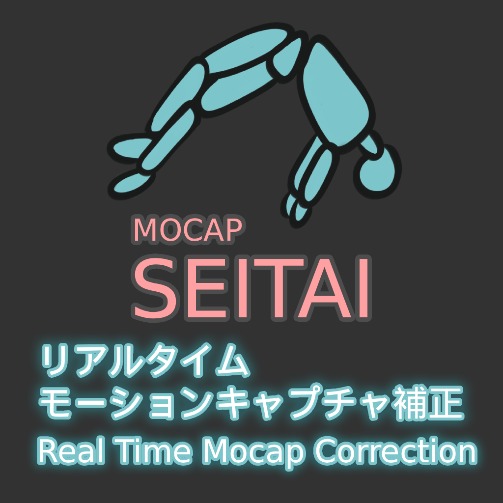
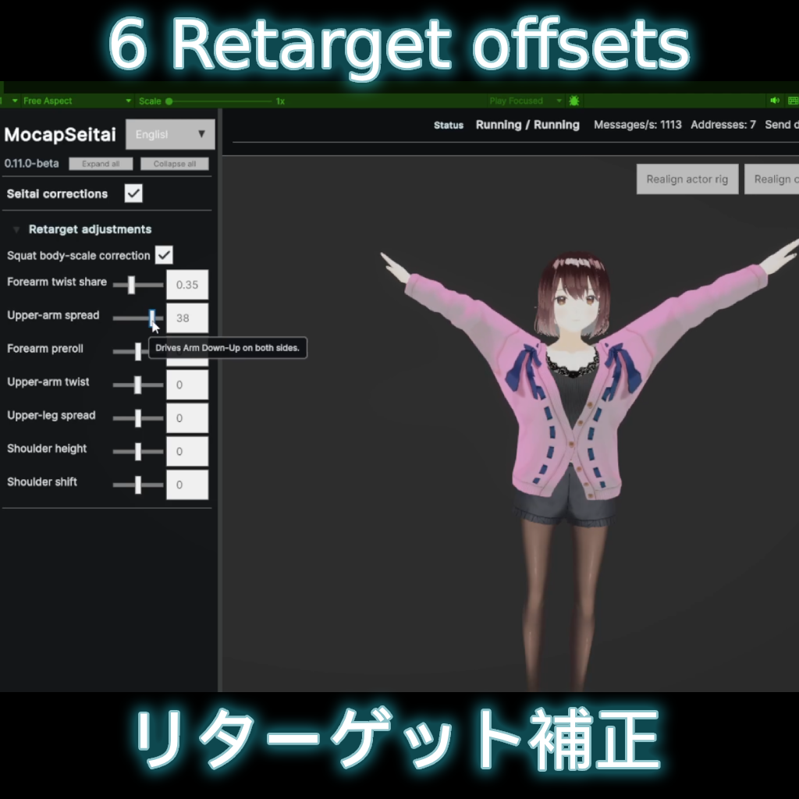
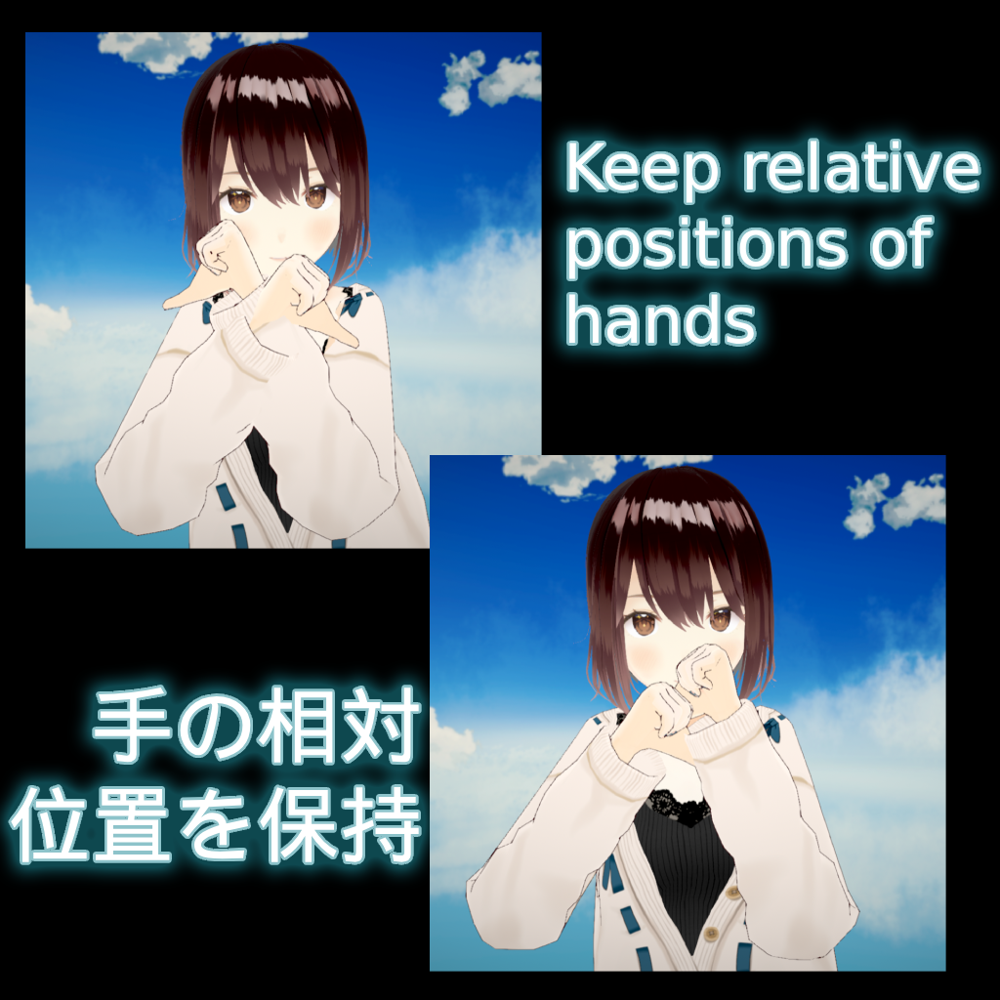
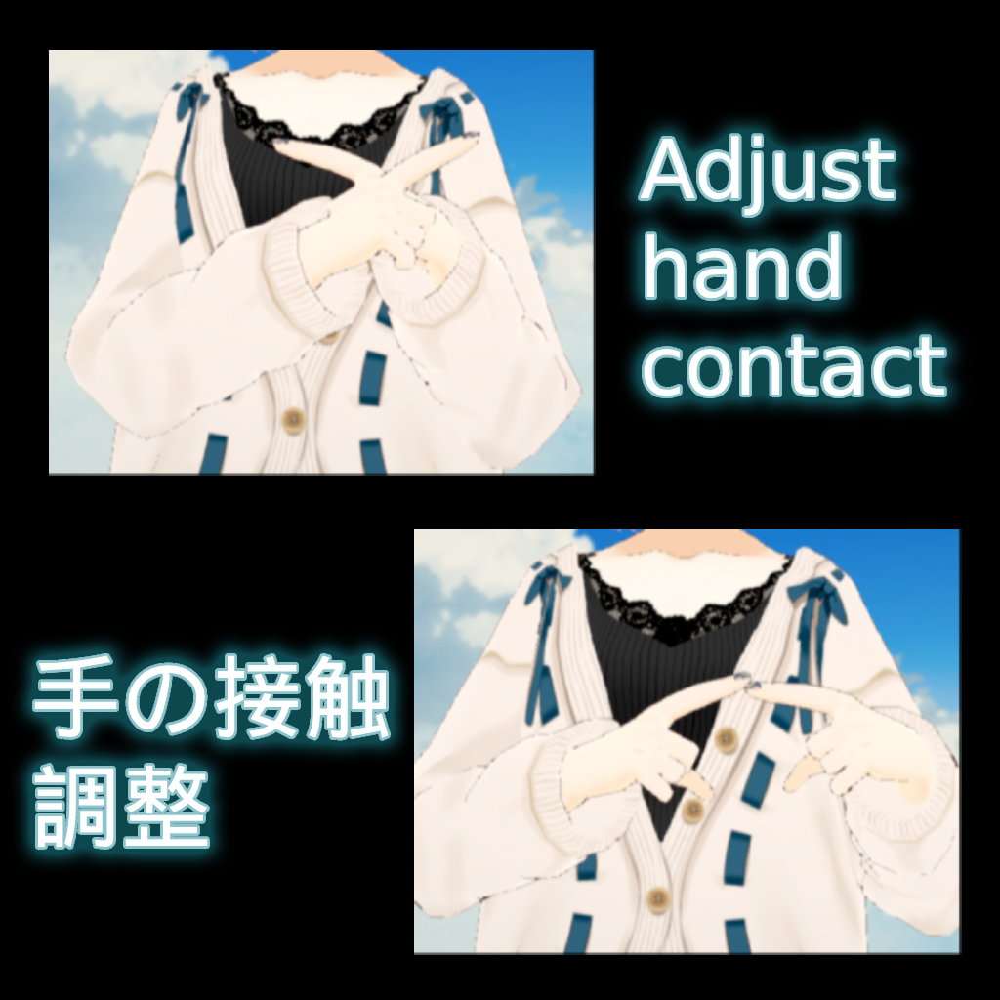
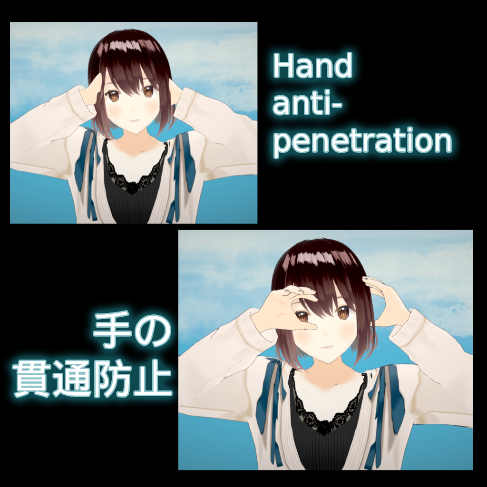

  <section class="mocapseitai-intro-hero">
    

      
Real-time mocap correction

      <h1>MocapSeitai</h1>
      
Retarget and correct live motion capture for one VRM avatar, then send the result to any VMC receiver.

      

        <a class="mocapseitai-intro-action primary" href="https://malloc5566.booth.pm/items/8764040" target="_blank" rel="noreferrer">Get it on BOOTH</a>
        <a class="mocapseitai-intro-action secondary" href="https://malloc.gumroad.com/l/mocapseitai" target="_blank" rel="noreferrer">Get it on Gumroad</a>
      

    

    
  </section>

  

    
Public beta 0.12.0-beta-1

    
MocapSeitai does not guarantee zero clipping for every motion or avatar.

  

  <section aria-labelledby="mocapseitai-about">
    <h2 id="mocapseitai-about">Live motion in. Corrected VMC out.</h2>
    
MocapSeitai is a Windows application for live humanoid motion capture. It receives motion from VMC, mocopi, or Rokoko, retargets and corrects it to one VRM avatar, and sends corrected VMC data to a receiver application.

    

      

        <h3>Input and output</h3>
        
Receive VMC, mocopi, or Rokoko motion. Send corrected VMC motion.

      

      

        <h3>Avatar support</h3>
        
Load VRM 0.x or VRM 1.0. Use the same VRM in the sender and receiver.

      

      

        <h3>Retargeting</h3>
        
Use Offset mode by default, or try the experimental Muscle mode.

      

      

        <h3>Review and save</h3>
        
Compare the source and corrected pose, then save settings for each avatar.

      

    

  </section>

  <section aria-labelledby="mocapseitai-corrections">
    <h2 id="mocapseitai-corrections">Retargeting and hand correction</h2>
    

      <figure>
        
        <figcaption><strong>Retarget adjustments</strong>Correct consistent arm, leg, and shoulder pose differences with six controls.</figcaption>
      </figure>
      <figure>
        
        <figcaption><strong>Spatial Hand</strong>Preserve the relative position of the hands for gestures that depend on body context.</figcaption>
      </figure>
      <figure>
        
        <figcaption><strong>Hand contact</strong>Experimentally adjust poses where the hands should meet.</figcaption>
      </figure>
      <figure>
        
        <figcaption><strong>Hand anti-penetration</strong>Experiment with physics-based or non-physics-based correction when hands enter the body.</figcaption>
      </figure>
    

  </section>

  <section class="mocapseitai-intro-details" aria-label="Trial and requirements">
    

      <h2>Try before you buy</h2>
      
The trial streams for up to 300 seconds in each app session with no feature limits. Test your own motion and avatar before you buy.

    

    

      <h2>Requirements</h2>
      <ul>
        <li>Windows 10 or 11</li>
        <li>A VRM 0.x or VRM 1.0 avatar</li>
        <li>A VMC receiver application</li>
      </ul>
    

  </section>

  <section aria-labelledby="mocapseitai-next">
    <h2 id="mocapseitai-next">Manual and support</h2>
    <nav class="mocapseitai-intro-links" aria-label="MocapSeitai manual and support links">
      <a href="./quickstart"><strong>Quickstart</strong>Install, connect, and send corrected motion.</a>
      <a href="./license"><strong>License</strong>Read the complete product terms.</a>
      <a href="./changelog"><strong>Changelog</strong>See the current public-beta release notes.</a>
      <a href="../bug-report"><strong>Support and bug reports</strong>Open a GitHub issue or send a BOOTH message.</a>
    </nav>
  </section>

