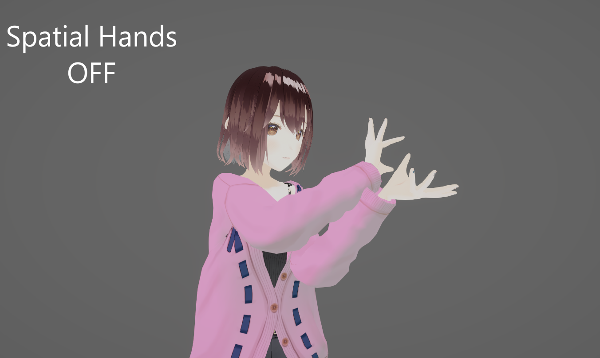
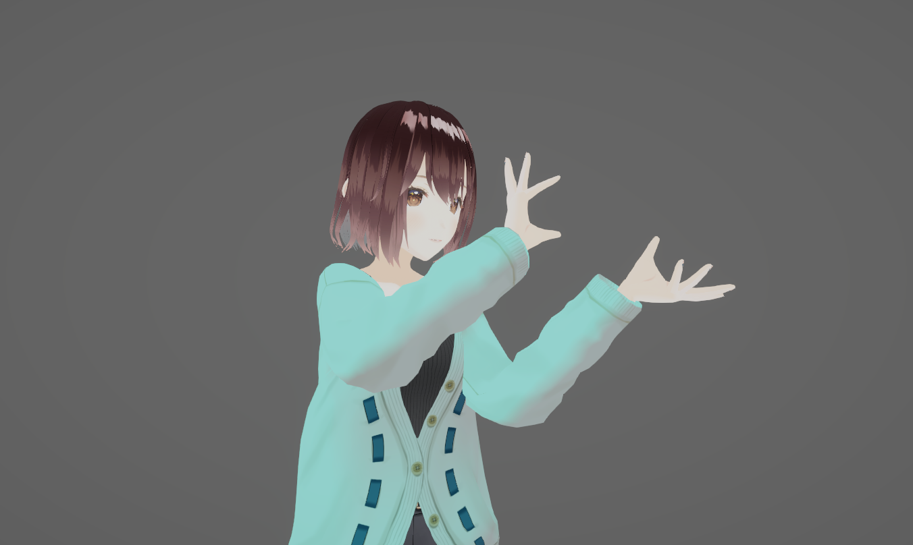
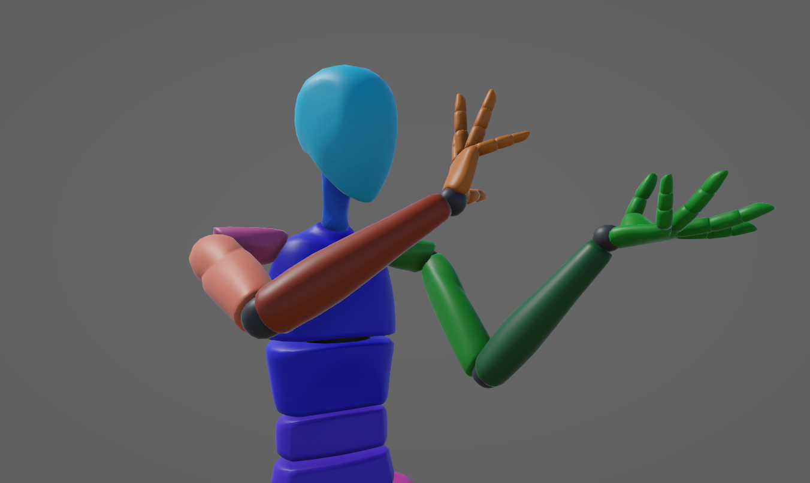
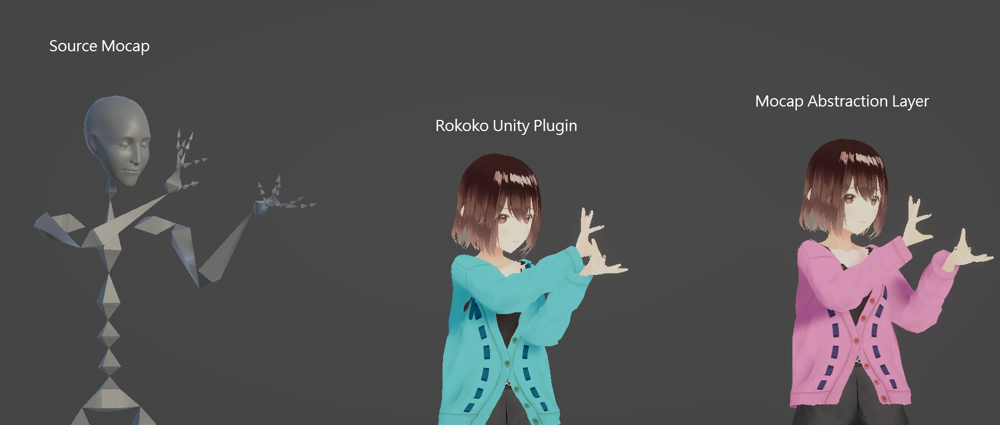
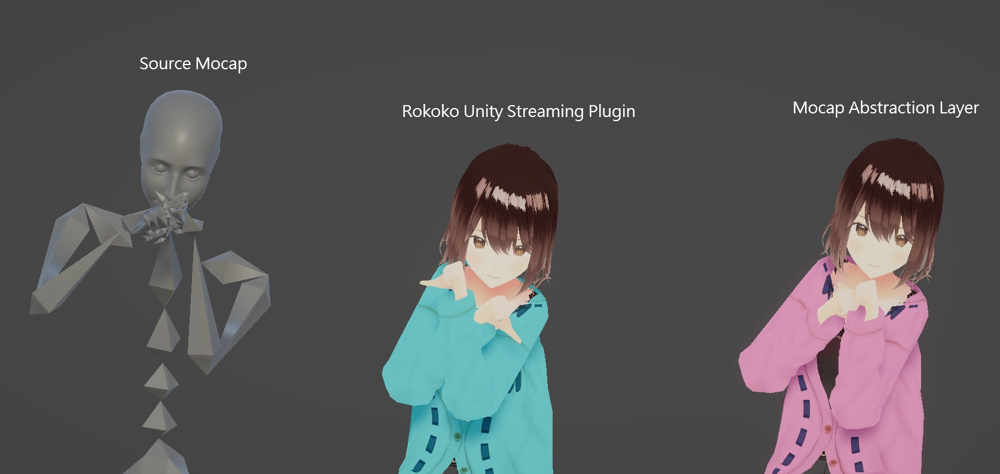

# Spatial hands

**Spatial Hand** places the avatar hands from their position relative to the tracked actor's head or shoulders. It then gives that position to hand IK. This can help maintaining context of some poses.

Use this page after you tune [Retarget adjustments](/MocapSeitai/retarget-adjustments). Spatial Hand does not replace experimental hand contact or hand anti-penetration. See [Experimental features](/MocapSeitai/experimental-features) for those controls.

## Before and after

  
  
</img-comparison-slider>

Drag the divider. The left side shows rotation retargeting only. The right side shows **Spatial Hand**.

### Source pose

## Limits

Spatial hands tune hand placement for one avatar. They do not guarantee that hands meet, avoid the body, or remain correct for every motion.
