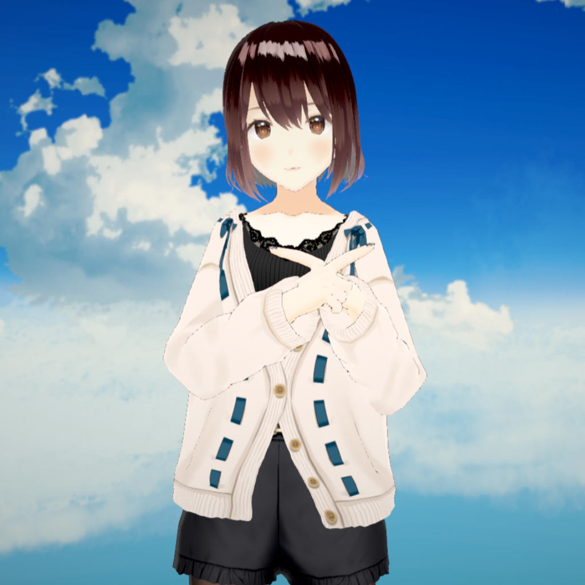
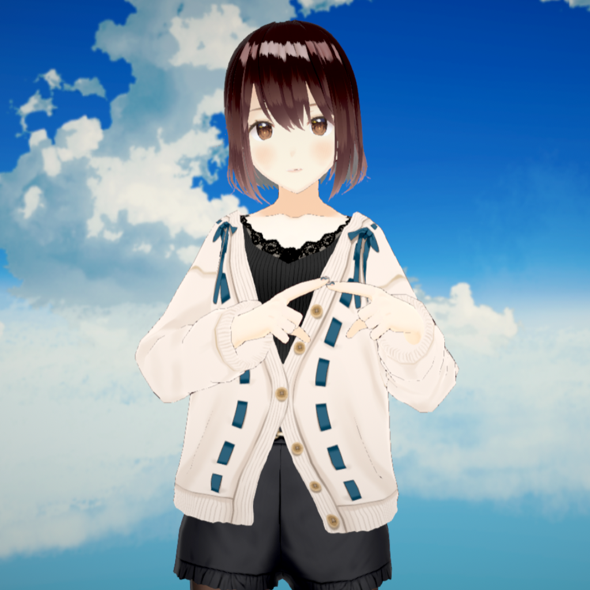
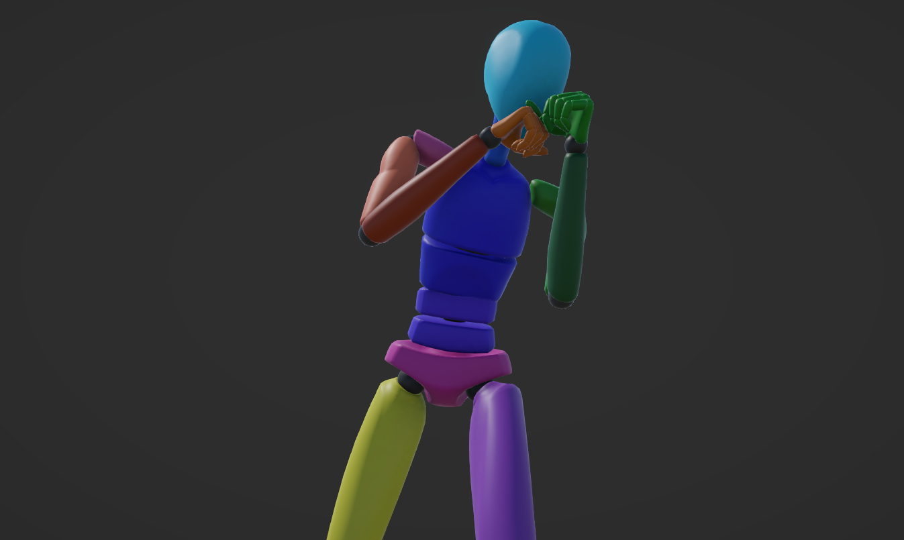
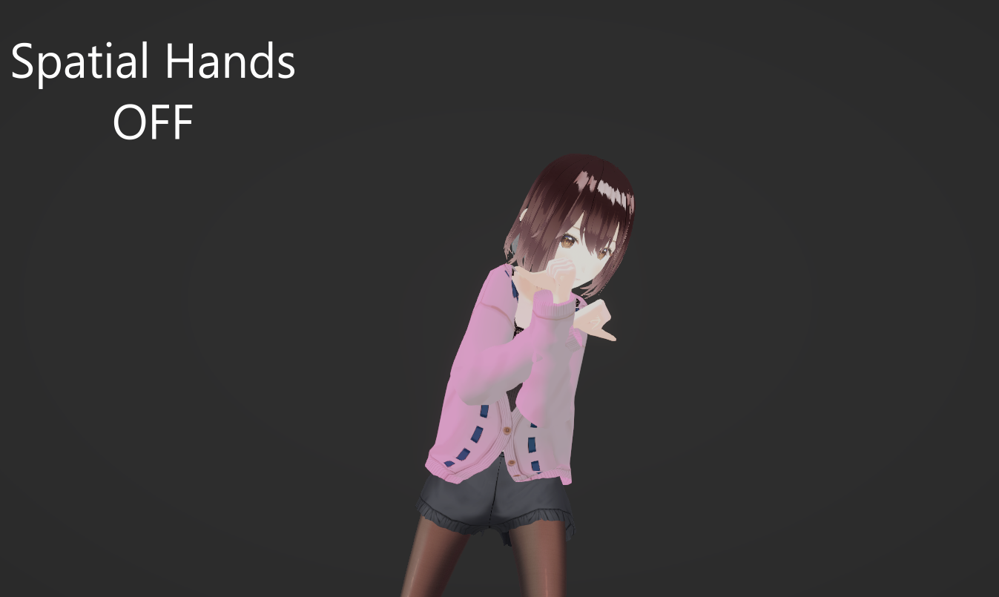
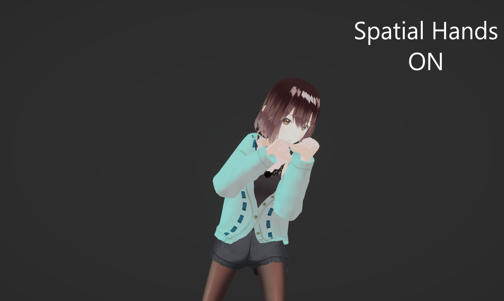

# Spatial hands

**Spatial Hand** places the avatar hands from their position relative to the tracked actor's head or shoulders. It then gives that position to hand IK. This can help maintaining context of some poses.

In this comparison, enabling **Spatial Hand** brings the hands from the rig's own proportions to the source distance.

Use **Slider** to drag the divider. The left side shows the hands apart before Spatial Hand. The right side shows the hands meeting at the source distance with **Spatial Hand**.

  <button type="button" :aria-pressed="comparisonMode === 'slider'" @click="comparisonMode = 'slider'">Slider</button>
  <button type="button" :aria-pressed="comparisonMode === 'side-by-side'" @click="comparisonMode = 'side-by-side'">Side by side</button>
  <button type="button" :aria-pressed="comparisonMode === 'overlay'" @click="comparisonMode = 'overlay'">Overlay</button>

  
  
</img-comparison-slider>

  <figure>
    
    <figcaption>Before Spatial Hand: hands apart at the rig's own proportions.</figcaption>
  </figure>
  <figure>
    
    <figcaption>With Spatial Hand: hands meeting at the source distance.</figcaption>
  </figure>

  
  

Use this page after you tune [Retarget adjustments](/MocapSeitai/retarget-adjustments). Spatial Hand does not replace hand anti-penetration. See [Experimental features](/MocapSeitai/experimental-features) for those controls.

## Before and after

Use **Slider** to drag the divider. The left side shows rotation retargeting only. The right side shows **Spatial Hand**.

  <button type="button" :aria-pressed="comparisonMode === 'slider'" @click="comparisonMode = 'slider'">Slider</button>
  <button type="button" :aria-pressed="comparisonMode === 'side-by-side'" @click="comparisonMode = 'side-by-side'">Side by side</button>
  <button type="button" :aria-pressed="comparisonMode === 'overlay'" @click="comparisonMode = 'overlay'">Overlay</button>

  
  
</img-comparison-slider>

  <figure>
    
    <figcaption>Before</figcaption>
  </figure>
  <figure>
    
    <figcaption>Spatial Hand</figcaption>
  </figure>

  
  

## Comparison 2

  <button type="button" :aria-pressed="comparisonMode === 'slider'" @click="comparisonMode = 'slider'">Slider</button>
  <button type="button" :aria-pressed="comparisonMode === 'side-by-side'" @click="comparisonMode = 'side-by-side'">Side by side</button>
  <button type="button" :aria-pressed="comparisonMode === 'overlay'" @click="comparisonMode = 'overlay'">Overlay</button>

 Source pose:

  
  
</img-comparison-slider>

  <figure>
    
    <figcaption>Before</figcaption>
  </figure>
  <figure>
    
    <figcaption>Spatial Hand</figcaption>
  </figure>

  
  

## Limits

Spatial hands tune hand placement based on the relative position of hands and head (or shoulders). They do not guarantee that hands meet, avoid the body, or remain correct for every motion.
