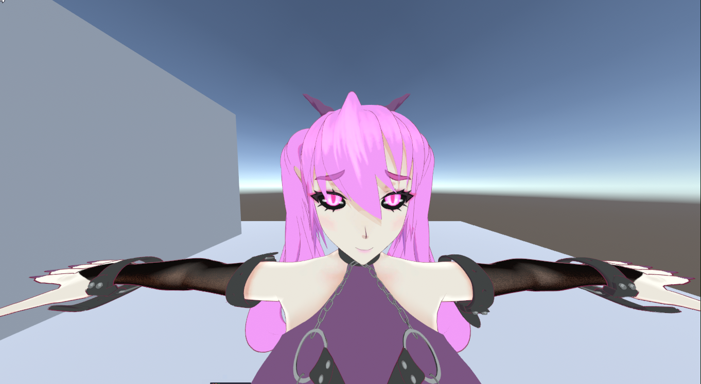
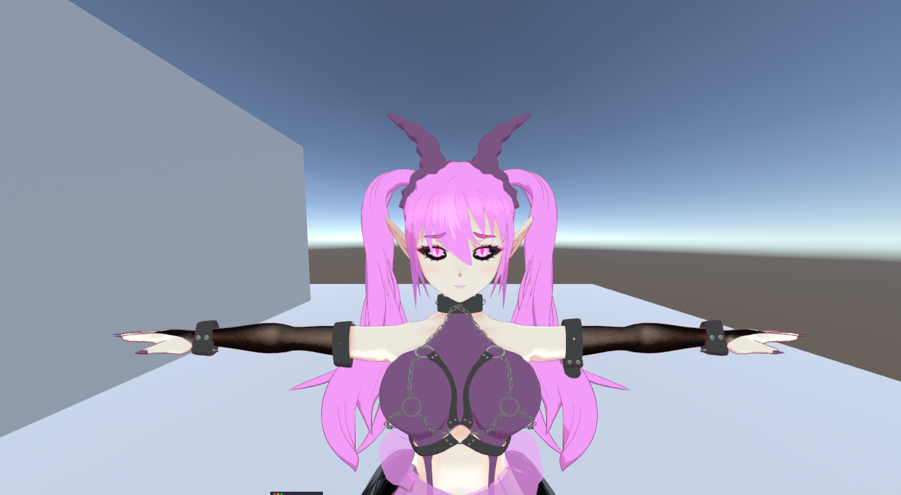

# Forced Perspective

<!-- CAPTURE: FP off/on toggle, close wide-angle camera on a face -->

Compresses the character's depth toward an anchor at render time, so a close wide-angle camera renders telephoto-like proportions instead of a stretched face.

The correction is computed per rendering camera in the shader, so multiple cameras each get their own correction at the same time. Outlines compress together with the geometry, shadow casters keep the true shape, and orthographic cameras are unaffected.

## Setup

1. Bake an **Anchor** with the [Data Baker](./data-baker)'s Anchor pass (one click — auto-detects the Hips bone).
2. Turn on **Forced Perspective** in the material editor.
3. Set **Strength**.

## Settings

- **Strength** — 0 = off, 1 = strong compression. The slider caps at 1, however values greater than 1 are supported (behaves like orthographic).
- **Anchor** — the baked anchor, read-only. The inspector warns if the material hasn't been baked yet.

## Perspective Controller

To drive the whole character from one place, add **lilEasyFace → Perspective Controller** to the avatar root. One enable toggle and one Strength control every lilEasyFace material under it, in the editor and at runtime.

It applies per-renderer overrides (MaterialPropertyBlock), so material assets are never modified — disable the component and rendering returns to the material values.

