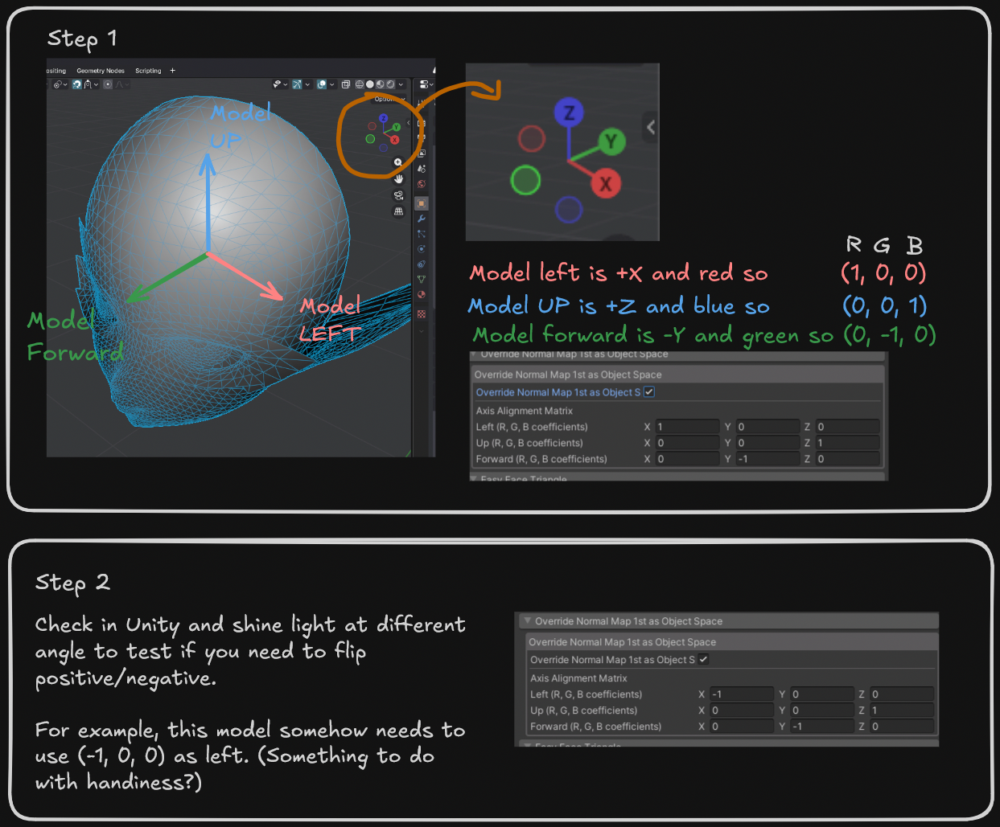

# Object-Space Normal Map

Reinterprets lilToon's main (1st) normal-map slot as an **object-space** normal map.

Normal maps are often in [tangent space](https://3dcoat.com/documentation/2025/01/13/types-of-normal-maps/). lilToon's normal map slots are intended for tangent space normal maps also. If one has a hand painted object space normal map for stylization, normally one would need to bake it to tangent space in Blender or other DCC software. This feature allows you to use an object space normal map directly.

## Enable

1. Import your object-space normal map. In the importer settings, its `Texture Type` should NOT be marked as normal map.
2. Assign your object-space normal map to the material's main **Normal Map** slot.
3. Open **Override Normal Map 1st as Object Space** and turn it on.
4. lilToon might complain about the normal map is not marked as a normal map. Press **Ignore** to suppress this warning.

## Settings

- **Override Normal Map 1st as Object Space** — on = interpret the main normal map as object-space (alpha 0 =
  vertex normal, alpha 1 = texture normal); off = standard tangent-space normal map (lilToon default).
- **Axis Alignment Matrix** — rotates the texture's RGB axes into mesh object-space. See below.

## Finding the axis alignment matrix
Each row (Left/Up/Forward) holds the (R, G, B) coefficients that build that component. 

The default matches the Blender object-space bake preset. ()

However, the matrix depends on the modelling software you use and the way you orient your model. See below on finding a matrix for your model:

